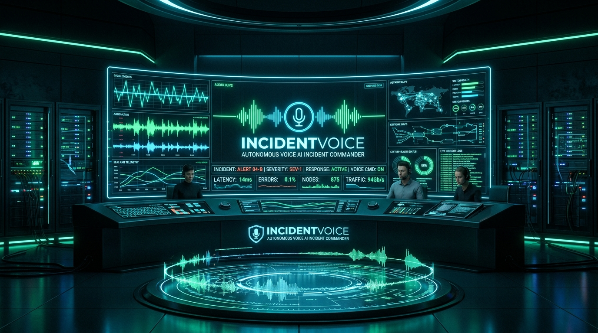

# IncidentVoice



**A voice-driven incident investigation and remediation assistant, built for the [AssemblyAI Voice Agent Hackathon](https://lablab.ai/ai-hackathons/assemblyai-voice-agent-hackathon).**

Ask about service health, inspect logs, follow runbooks, approve a remediation, and generate an incident review. The dashboard clearly distinguishes simulation, live infrastructure, provider-generated reports, and local fallback summaries.

## Capabilities

- **Custom voice engine:** AssemblyAI Streaming v3 transcription → Gemini or OpenAI tool calling → Edge TTS, with browser speech fallback.
- **Managed voice engine:** AssemblyAI Voice Agent API integration with shared SRE tools and approval policy.
- **Explicit approvals:** Mutations are staged for 30 seconds. Confirm verbally, speak the displayed phonetic challenge, or approve the matching action card. Cancellation, expiry, and disconnect discard pending approvals.
- **Demo simulation:** Isolated service state, fault scenarios, dependency topology, and optional automatic approval of requested demo actions.
- **Live Docker:** Inspect configured containers and request real restarts. Recovery is reported only when a container health check verifies it.
- **Kubernetes adapter:** Inspect pods, request deployment rollout restarts, and cordon nodes using the configured host `kubectl` context.
- **Runbooks:** Database, Redis, and ingress investigation workflows with approval and telemetry gates. Completing a runbook does not imply that every cluster service recovered.
- **Incident review:** AssemblyAI LeMUR can generate an evidence-based summary and draft follow-up tickets. Failures return labeled local summaries. Nothing is posted to Slack, Jira, Linear, or PagerDuty automatically.
- **Captured audio:** Session PCM recording, waveform, and transcript markers. Custom-engine TTS and browser speech are not recorded; managed-engine audio is captured. Text-only sessions have no audio replay.
- **Audit chain:** Session-local, in-memory SHA-256 tamper-evident records. No hardware MFA or compliance certification is claimed.

## Quick start

Prerequisites: Python 3.11+, Node.js 20+, npm. Docker is optional.

```bash
cp .env.example .env
# Set ASSEMBLYAI_API_KEY in .env for voice and LeMUR.
# Set GEMINI_API_KEY or OPENAI_API_KEY and select LLM_PROVIDER for custom reasoning.
./scripts/dev.sh
```

- Dashboard: http://localhost:5173
- API docs: http://localhost:8000/docs

The startup script installs backend and frontend dependencies. Start with `INFRASTRUCTURE_MODE=simulation`. Without an LLM key, custom reasoning uses labeled scripted commands. Without AssemblyAI, text commands still work, but microphone transcription and LeMUR generation are unavailable.

When `OPERATOR_ACCESS_TOKEN` is set, enter that token in the dashboard's sign-in form. Live modes require it. Microphone capture requires HTTPS or localhost and browser permission.

## Demo flow

1. Verify the dashboard shows the intended infrastructure mode and provider status.
2. Enable the microphone and wait for voice to become ready.
3. Ask **“What alerts are firing right now?”**, then **“Inspect logs for payment-service.”**
4. Ask **“Restart payment-service.”** Confirm the staged action and inspect the execution result.
5. In simulation, use the Chaos Simulator buttons to inject faults or restore demo health.
6. Start the PostgreSQL runbook after injecting database starvation; its first diagnostic step should allow you to reach remediation.
7. Ask **“Generate postmortem.”** Check whether its source is AssemblyAI LeMUR or a local summary; tickets remain drafts.

## Verification

```bash
# From backend/ after installing requirements:
.venv/bin/pytest tests/ -q

# From frontend/:
npm ci
npm run build
npm test
```

Backend tests use isolated sessions, simulation, and mocked external calls. They cover authentication, approvals, session isolation, runbooks, scenario transitions, audio exports, tool calling, provider failures, and report provenance. Frontend tests cover startup, login/error visibility, scenario dispatch, unavailable telemetry, and honest artifact/audio states.

Passing automated tests does not verify live AssemblyAI credentials or microphone/browser compatibility. Rehearse one real voice session and inspect the provider status before recording the submission.

## Deployment

See [Deployment guide](docs/DEPLOYMENT_GUIDE.md). The unified Docker image serves the React 18 dashboard and FastAPI backend on port 8000 and includes the Docker CLI. Cloud demos should use simulation; live Docker requires access to a host daemon and an operator token.

Sessions, transcripts, recordings, and audit chains live in one backend process and expire after eight hours or on server restart. Run one worker/replica for this prototype. Export artifacts you want to retain.

Older pitch materials under `docs/` describe earlier aspirations. This README and the deployment guide describe the current supported behavior.

## License

[MIT](LICENSE)
