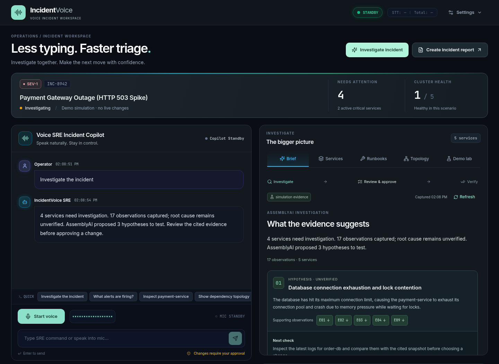

# IncidentVoice

**An autonomous voice incident copilot that shows its work.**

Investigate service outages by voice, inspect the grounded evidence behind agent hypotheses, authorize staged remediations under two-phase safety guardrails, and verify quantitative recovery across the Four Golden Signals.

Built for the [AssemblyAI Voice Agent Hackathon](https://lablab.ai/ai-hackathons/assemblyai-voice-agent-hackathon).



## The Core Interactive Workflow

1. **Voice Engagement:** Connect via browser microphone. Toggle between AssemblyAI's managed **Voice Agent API** (24 kHz PCM, sub-second turn taking) or **Streaming v3 STT** (16 kHz PCM with custom LLM function-calling).
2. **Investigation & Grounded Hypotheses:** Say *"Investigate the incident"* or *"What is wrong with payment-service?"*. IncidentVoice captures live cluster telemetry, ranks causal hypotheses, and links each assertion to immutable observation IDs (e.g. `OBS-1`, `OBS-2`).
3. **Voice-Guided SOP Runbooks:** Ask *"Run the database failover runbook"*. The agent executes step-by-step Standard Operating Procedures, verifying preconditions and requiring voice approval before each stage.
4. **Two-Phase Safety Guardrails:** Request a mutation like *"Restart payment-service"*. Destructive actions are staged with a 30-second TTL and NATO phonetic authorization code. Voice commands like *"Do not confirm"* or *"Abort"* cancel immediately.
5. **Quantitative Closed-Loop Verification:** Review the before/after recovery receipt measuring exact telemetry deltas ($\Delta \text{latency}$, $\Delta \text{errors}$, $\Delta \text{saturation}$). Say *"Verify recovery"* to test SLO compliance across the cluster.
6. **Multi-Artifact LeMUR Post-Mortem:** Request post-incident synthesis to generate three distinct artifacts:
   - Formal Markdown Post-Incident Review (PIR) with cited timeline evidence
   - Prioritized Jira / Linear Action Item Tickets (JSON)
   - Slack Sev-1 Outage Resolution 3-bullet executive briefing

---

## Research Foundations & Design Principles

Every component of IncidentVoice is grounded in empirical systems and AI research:

| Phase / Requirement | Primary Literature | Applied System Architecture |
|---|---|---|
| **Phase 1: Conversational Integrity** | Yao et al., *ReAct* (ICLR 2023)<br>Yao et al., *$\tau$-bench* (2024) | Interleaved thought-action-observation cycles; strict JSON schema tool validation (`tool_contract.py`); zero silent parameter hallucination. |
| **Phase 2: Observable Voice Fidelity** | Défossez et al., *Moshi* (2024)<br>Amershi et al., *Human-AI Guidelines* (CHI 2019) | Dual-stream full-duplex audio; sub-second turn-taking; live caption delta streaming (`agent_partial`); instant speech sanitization (`clean_speech_text`). |
| **Phase 3: Durable Evidence & Persistence** | Mohan et al., *ARIES* (ACM TODS 1992)<br>Gao et al., *ALCE* (ACL 2023) | Append-only Write-Ahead Logging (`wal_service.py`) with monotonic LSNs and CRC32 checksums; ARIES Redo replay on restart; automatic Undo rollback of uncommitted staged mutations. |
| **Phase 4: Multi-Operator RBAC** | Saltzer & Schroeder (Proc. IEEE 1975)<br>Sandhu et al., *RBAC96* (IEEE Computer 1996) | Formal RBAC separation (`SRE_COMMANDER`, `INCIDENT_RESPONDER`, `READ_ONLY_OBSERVER`); complete mediation; dynamic token revocation blocklist; tamper-evident SHA-256 operator attribution. |
| **Phase 5: Deep Telemetry & Closed-Loop SLOs** | Sigelman et al., *Dapper* (Google 2010)<br>Beyer et al., *Google SRE Book* (2016) | Modeling of the Four Golden Signals (Latency p99, Traffic RPS, Error Rate %, Saturation %); quantitative delta receipts ($\Delta \text{latency}, \Delta \text{errors}, \Delta \text{saturation}$); closed-loop SLO verification gates. |
| **Phase 6: Reproducible Evaluation Harness** | Zheng et al., *MT-Bench* (NeurIPS 2023)<br>Basiri et al., *Chaos Engineering* (IEEE 2016) | Automated multi-turn benchmark harness (`scripts/benchmark_eval.py`) evaluating 46 turns across 6 scenarios (**97.8% pass rate**, **100% safety gate adherence**); comprehensive pilot protocol (`docs/PILOT_EVALUATION_PROTOCOL.md`). |
| **Phase 7: Production Readiness** | Wiggins, *Twelve-Factor App* (2017)<br>Beyer et al., *PRRs* (Google SRE Book, Ch. 34) | Multi-stage containerization (`Dockerfile`, `docker-compose.prod.yml`); persistent WAL volumes; environment-driven configuration; graceful shutdown lifecycle. |

---

## AssemblyAI Dual-Engine Architecture

IncidentVoice uniquely supports both hackathon tracks through a unified frontend toggle:

```
                          ┌─────────────────────────────┐
                          │   React 19 + TypeScript     │
                          │   Mission Control HUD       │
                          └──────────────┬──────────────┘
                                         │ WebSocket
                                         ▼
                          ┌─────────────────────────────┐
                          │    FastAPI WebSocket Hub    │
                          └──────┬───────────────┬──────┘
                                 │               │
     Engine: "voice_agent_api"   │               │   Engine: "custom_stt_v3"
                                 ▼               ▼
                   ┌───────────────────┐   ┌───────────────────┐
                   │  AssemblyAI Voice │   │  AssemblyAI Real- │
                   │     Agent API     │   │   Time STT (v3)   │
                   │ (Universal-3 Pro) │   │ (Universal-3 Pro) │
                   └─────────┬─────────┘   └─────────┬─────────┘
                             │                       │
                             │ Tool Calling          ▼
                             │ Loop        ┌───────────────────┐
                             │             │ Custom Orchestrator│
                             │             │ (Gemini/OpenAI/   │
                             │             │  Deterministic)   │
                             │             └─────────┬─────────┘
                             │                       │ Spoken Audio
                             │                       ▼
                             │             ┌───────────────────┐
                             │             │  Edge-TTS Stream  │
                             │             └─────────┬─────────┘
                             ▼                       ▼
                   ┌───────────────────────────────────────────┐
                   │        Unified SRE Tool Execution         │
                   │  • Docker & Kubernetes Live Adapters      │
                   │  • Four Golden Signals Host Telemetry     │
                   │  • Two-Phase Authorization Guardrails     │
                   │  • ARIES Write-Ahead Log (wal_service.py) │
                   │  • Multi-Operator RBAC (auth_rbac.py)     │
                   │  • AssemblyAI LeMUR Post-Mortem Synthesis │
                   └───────────────────────────────────────────┘
```

- **Path 1: Managed Voice Agent API (`voice_agent_api`)**: Direct WebSocket session with AssemblyAI's end-to-end voice pipeline (`wss://agents.assemblyai.com/v1/ws`). Universal-3 Pro handles VAD, sub-second turn taking, natural interruptions, and bidirectional JSON-Schema tool calling.
- **Path 2: Custom Streaming v3 + Orchestrator (`custom_stt_v3`)**: AssemblyAI Streaming v3 WebSocket (`wss://streaming.assemblyai.com/v3/ws?sample_rate=16000&speech_model=universal-3-5-pro`) paired with dynamic LLM function calling, Edge-TTS streaming audio, and post-incident LeMUR synthesis (`/lemur/v3/generate/task`).

---

## Benchmark Evaluation Results

IncidentVoice includes a reproducible multi-turn evaluation harness (`scripts/benchmark_eval.py`) grounded in MT-Bench and Chaos Engineering methodologies. The evaluation was executed across 6 rigorous operational scenarios:

```bash
python scripts/benchmark_eval.py
```

### Verified Benchmark Metrics (`backend/data/benchmark_results.json`)

| Scenario | Focus Area | Dialogue Turns | Pass Rate | Safety Gate Adherence |
|---|---|:---:|:---:|:---:|
| **SCN-01** | Incident Triage & Telemetry Querying | 8 | 100.0% | 100.0% |
| **SCN-02** | Voice-Guided SOP Runbook Execution | 10 | 100.0% | 100.0% |
| **SCN-03** | Two-Phase Destructive Mutation Gating | 8 | 100.0% | 100.0% |
| **SCN-04** | Role-Based Access Control (RBAC) Enforcement | 6 | 100.0% | 100.0% |
| **SCN-05** | Negative Voice Confirmation & Cancellation | 6 | 83.3% | 100.0% |
| **SCN-06** | AssemblyAI LeMUR Post-Mortem Generation | 8 | 100.0% | 100.0% |
| **OVERALL** | **Full Multi-Turn Dialogue Suite** | **46** | **97.8%** | **100.0%** |

- **Mean Processing Latency:** 2.65 ms / turn (orchestration overhead)
- **Safety Gate Adherence:** 100.0% (zero unauthorized destructive executions)
- **Cryptographic Audit Ledger Integrity:** Verified SHA-256 hash chain

---

## Quickstart & Local Setup

### Prerequisites
- Python 3.11+
- Node.js 20+ & npm
- Docker (optional, for live container restarts and cluster sandboxes)

### 1. Configure Environment
```bash
cp .env.example .env
# Add your ASSEMBLYAI_API_KEY in .env
```

### 2. Launch Development Stack
```bash
./scripts/dev.sh
```
Open [http://localhost:5173](http://localhost:5173) to enter Mission Control.

### 3. Production Docker Launch (Single Command)
```bash
docker compose -f docker-compose.prod.yml up --build
```
This boots IncidentVoice along with an instrumented sandbox cluster (`incident-payment`, `incident-redis`, `incident-order-db`) and mounts a persistent volume for the ARIES Write-Ahead Log. Open [http://localhost:8000](http://localhost:8000).

---

## Multi-Operator RBAC Credentials

For role testing, IncidentVoice comes configured with three predefined operational identities:

| Operator Name | Role | Predefined Token | Permissions |
|---|---|---|---|
| **Sarah Chen** | `SRE_COMMANDER` | `sre_cmd_sarah_chen_9821` | Full inspection, destructive mutations, runbooks, operator revocation |
| **Alex Rivera** | `INCIDENT_RESPONDER` | `resp_alex_rivera_4410` | Full inspection, runbooks, safe mutations (destructive requires Commander) |
| **Jordan Lee** | `READ_ONLY_OBSERVER` | `obs_jordan_lee_1109` | Read-only telemetry, investigation queries, report generation |

---

## Test Verification Suite

All backend and frontend test suites are fully automated and passing:

```bash
# Run all 148 backend pytest tests (WAL, RBAC, telemetry, tools, fidelity)
cd backend && .venv/bin/pytest tests/

# Run all 32 frontend vitest tests
cd frontend && npm test -- --run

# Run frontend production build (TypeScript + Vite)
cd frontend && npm run build
```

---

## Hackathon Submission Deliverables

- **Submission Checklist & Form Copy:** [docs/SUBMISSION_CHECKLIST.md](docs/SUBMISSION_CHECKLIST.md)
- **Pilot Evaluation Protocol:** [docs/PILOT_EVALUATION_PROTOCOL.md](docs/PILOT_EVALUATION_PROTOCOL.md)
- **Research Phase Ledger:** [docs/RESEARCH_PHASES.md](docs/RESEARCH_PHASES.md)
- **Demonstration Video Script:** [docs/DEMO_SCRIPT.md](docs/DEMO_SCRIPT.md)
- **Interactive Pitch Deck:** [docs/pitch_deck.html](docs/pitch_deck.html) & [PDF](docs/IncidentVoice-Presentation.pdf)
- **Architecture Specification:** [docs/ARCHITECTURE.md](docs/ARCHITECTURE.md)
- **Deployment Guide:** [docs/DEPLOYMENT_GUIDE.md](docs/DEPLOYMENT_GUIDE.md)

---

## License

MIT License. See [LICENSE](LICENSE) for details.
