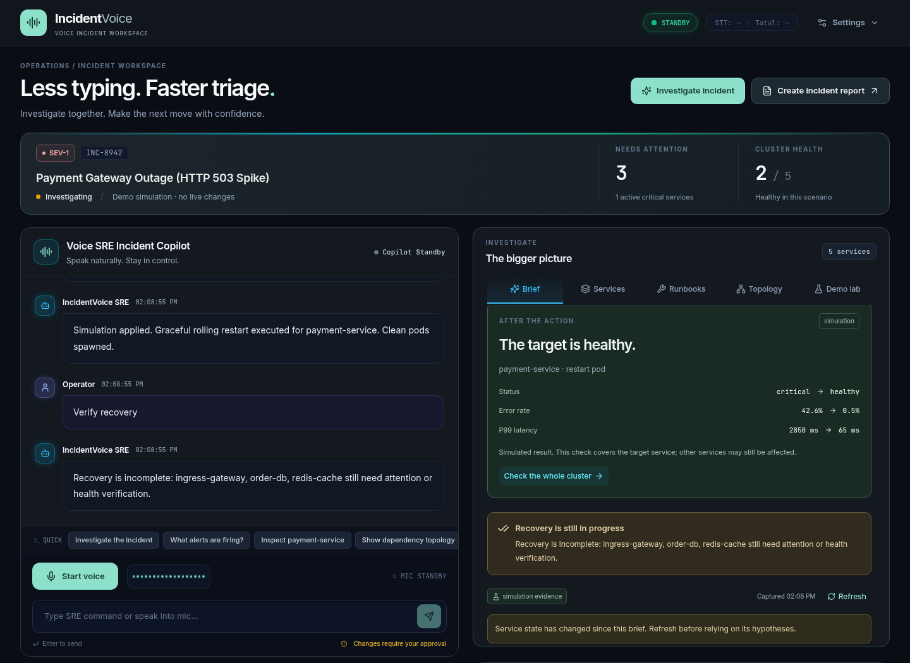

# IncidentVoice — presentation

Updated September 11, 2026. Present only results observed in the final demo.

## IncidentVoice — An incident copilot that shows its work.

Connect voice-led investigation to cited observations, explicit approvals, and recovery verification.

- Built for the AssemblyAI Voice Agent Hackathon
- Voice triage, explicit approvals, evidence-based incident reviews

## 01 / THE PROBLEM — Keep the investigation moving.

During an outage, engineers move between conversations, logs, service health, and follow-up notes.

- A successful command is not proof of a recovered service.
- Engineers need to inspect the diagnosis, control the action, and verify its effect.
- Target users: on-call engineers and small platform teams.

## 02 / THE WORKFLOW — From a question to a reviewed action.

Ask about the incident, inspect evidence, and decide what should happen next.

- Investigate → capture health and logs, then inspect evidence-linked hypotheses.
- Stage → show the exact action, service, parameters, and approval expiry.
- Approve or cancel → execute once, then show the observed result.
- Verify → compare before/after health and check the remaining incident impact.

## 03 / ASSEMBLYAI — Two voice paths. One tool boundary.

Both voice engines share the same session and approval logic.

- Managed: AssemblyAI Voice Agent API with 24 kHz PCM audio and client tools.
- Custom: AssemblyAI Streaming v3 STT → configured LLM or labeled scripted commands → speech output.
- Investigation briefs and reports: AssemblyAI LLM Gateway analyzes captured evidence.
- Provider failures and local fallbacks are visible in the workspace.

## 04 / OPERATOR CONTROL — Approval is part of execution.

A model request stages a mutation. A second tool call does not authorize it.

- Each action has a unique ID, exact target, and a 30-second approval window.
- Cancellation, expiry, role checks, and replay rejection are enforced in the backend.
- Live infrastructure requires an operator token.
- Automatic approval is restricted to explicitly enabled simulation.

## 05 / EVIDENCE — Open the observation behind the hypothesis.

Captured facts. Inspectable hypotheses.

- 17 observations from five simulated services in this demonstration.
- AssemblyAI analysis linked to exact evidence IDs.
- Read-only next checks; stale evidence is flagged.

## 06 / RECOVERY — A healthy target. An incident still in progress.

Success needs context.

- Approve the exact service restart.
- Compare observed before/after target health.
- Check the whole cluster: three services still need attention here.
- Export the evidence and outcomes for the next engineer.

## 07 / NEXT STEPS — A focused prototype with a clear path.

The next milestone is a repeatable, measured pilot with an on-call team.

- Current limits: in-memory single-process sessions and limited live infrastructure actions.
- Validate microphone quality, interruptions, and response latency on the deployment target.
- Add persistent evidence storage, individual identities, and deeper telemetry integrations.
- Supply the final repository, HTTPS app, and demo video links in the submission form.
